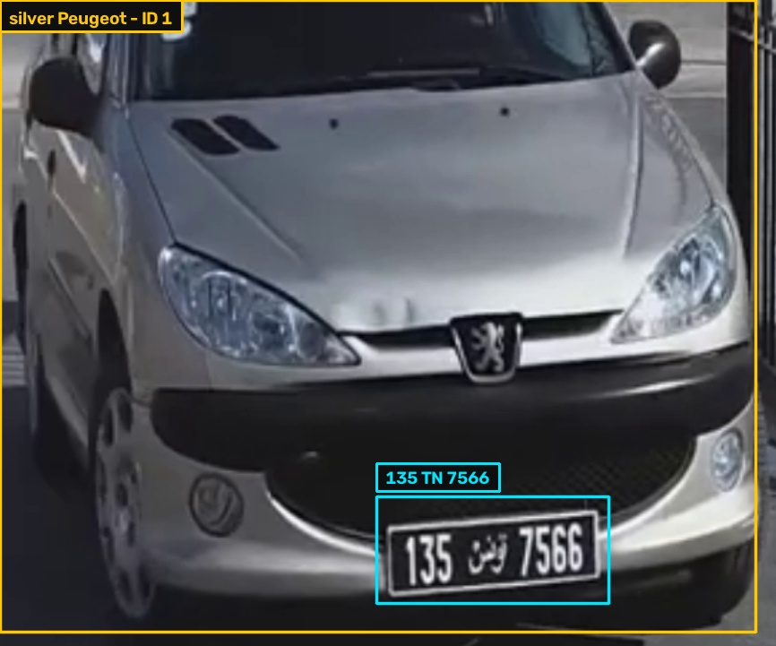
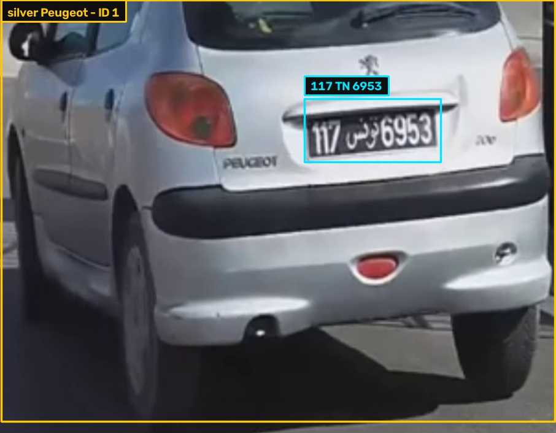
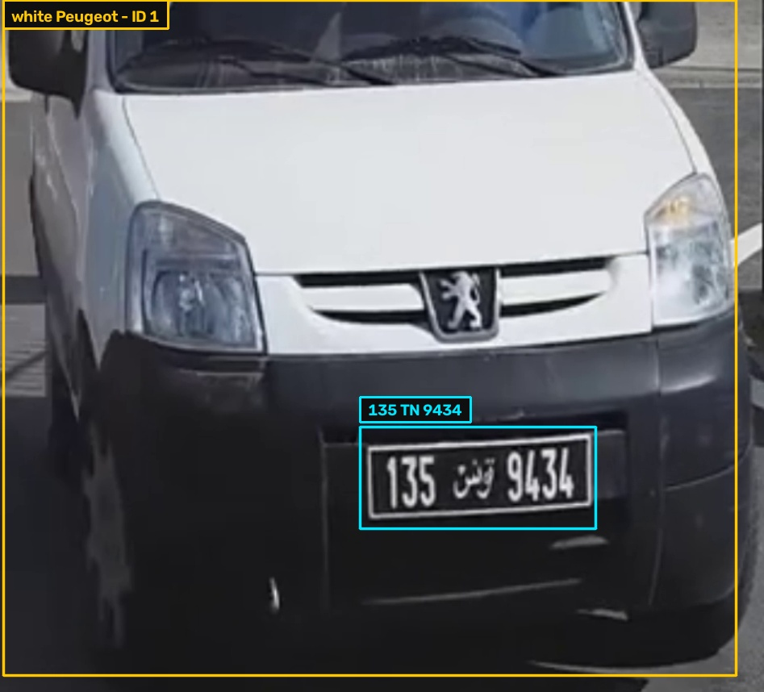
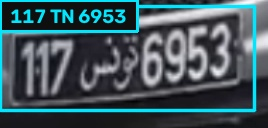
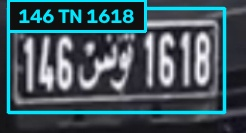

# Tunisian Vehicle Search Using VLMs and CLIP

Developed by Wassim Hfaiedh

This project uses object detection (YOLO) and a vision-language model (VLM) to detect
vehicles and read their license plates exactly as printed — including Tunisian-style
plates (digits + "TN" + digits). Every detected vehicle is also embedded with CLIP, so
you can search your logged vehicles using natural language ("silver peugeot") or by
uploading a photo of a car or a license plate.

## Demo

**General overview**

[](assets/TunisianVehicleSearch.mp4)

*Click the image to open/download `TunisianVehicleSearch.mp4`.*

**YOLO detection + VLM plate extraction (annotated output)**

`v1_annotated.mp4` shows the raw pipeline output: YOLO detects each vehicle and its
plate, ByteTrack keeps a consistent ID across frames, and the Nemotron VLM reads the
plate text as soon as the vehicle crosses the counting line.

[](assets/v1_annotated.mp4)

*Click the image to open/download `v1_annotated.mp4`.*

**Detected vehicles**

|  |  |  |
|:---:|:---:|:---:|
| silver Peugeot : 135 TN 7566 | silver Peugeot : 117 TN 6953 | White Peugeot van : 135 TN 9434 |

**License plate reads**

|  |  |
|:---:|:---:|

## Structure

```
app.py                          # Gradio UI (process video + semantic search)
vehicle_clip_search/
  config.py                     # settings, loaded from .env
  pipeline.py                   # detection + tracking + VLM + storage
  clip_embedder.py               # open_clip image/text embeddings
  vector_store.py                # ChromaDB read/write
requirements.txt
```

## Setup

```bash
git clone https://github.com/Wassimhfaiedh/TunisianVehicleSearch.git
cd TunisianVehicleSearch
python -m venv .venv && source .venv/bin/activate   
pip install -r requirements.txt
```

Place your model weights (`yolov8s.pt`, `license_plate_detector.pt`) in the project
root, or point `VEHICLE_MODEL_PATH` / `PLATE_MODEL_PATH` in `.env` to their location.

## Run

```bash
python app.py
```

Opens at `http://127.0.0.1:7860`.

1. **Process Video tab** — upload a video, click two points on the frame to set the
   crossing line, enter your Nemotron API key, click Process.
2. **Semantic Search tab** — search by text ("silver peugeot") or by uploading a
   car/plate photo.

## Notes

- Get an NVIDIA API key at https://build.nvidia.com.
- `captures/` and `vehicle_search_chroma/` are created at runtime and are gitignored.
- Never commit `.env` or model weights with embedded keys.
- Demo videos live in `assets/`. GitHub only auto-renders an inline video player for
  `user-attachments` links (the ones you get by dragging a file into an issue/PR
  comment) — a plain link to an `.mp4` in the repo, like the ones above, opens or
  downloads the file instead of playing inline. That's why the demo uses clickable
  thumbnails instead of an embedded player.
